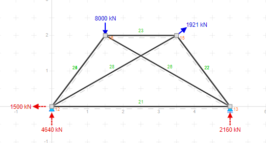

# STRUCTURAL ANALYSER
## A1 resolvida:

usei os dados do grupo 1: massa suspensa

[A1 Resolvida](src/main/resources/A1_Solved.md)

[Ex1 Resolvida](src/main/resources/EX1_Solved.md)

## referencia
foi usado de referencia o site
https://structural-analyser.com/
para validar os calculos

