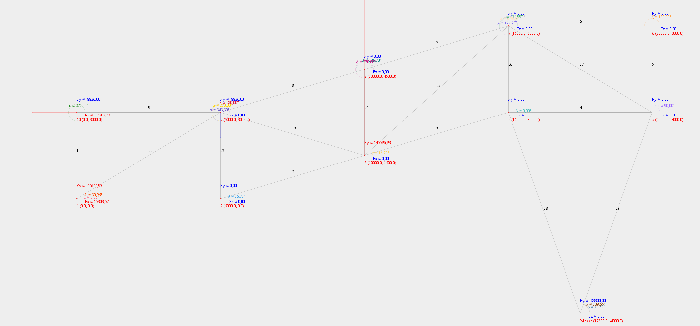

# STRUCTURAL ANALYSER
## A1 resolvida:

usei os dados do grupo 1: massa suspensa

### Nós
```java
List<Point2D> points = Arrays.asList(
    new Point2D( "1",     0.0,    0.0, null,    null),
    new Point2D( "2",  5000.0,    0.0, +0.0,    +0.0),
    new Point2D( "3", 10000.0, 1500.0, +0.0,    null),
    new Point2D( "4", 15000.0, 3000.0, +0.0, -4000.0),
    new Point2D( "5", 20000.0, 3000.0, +0.0, -4000.0),
    new Point2D( "6", 20000.0, 6000.0, +0.0,    +0.0),
    new Point2D( "7", 15000.0, 6000.0, +0.0,    +0.0),
    new Point2D( "8", 10000.0, 4500.0, +0.0,    +0.0),
    new Point2D( "9",  5000.0, 3000.0, +0.0,    +0.0),
    new Point2D("10",     0.0, 3000.0, null,    +0.0)
);  
```

### Elementos (barras)
```java
double radius = utils.convertMillimeterToMeter(utils.inchToMillimeters(1));
double modulusOfElasticity = AISI_ACO_1045.getKgfPreMm2();

List<Elemento> elements = Arrays.asList(
    new Elemento( "1", modulusOfElasticity, radius, points.get( 1-1), points.get( 2-1)),
    new Elemento( "2", modulusOfElasticity, radius, points.get( 2-1), points.get( 3-1)),
    new Elemento( "3", modulusOfElasticity, radius, points.get( 3-1), points.get( 4-1)),
    new Elemento( "4", modulusOfElasticity, radius, points.get( 4-1), points.get( 5-1)),
    new Elemento( "5", modulusOfElasticity, radius, points.get( 5-1), points.get( 6-1)),
    new Elemento( "6", modulusOfElasticity, radius, points.get( 6-1), points.get( 7-1)),
    new Elemento( "7", modulusOfElasticity, radius, points.get( 7-1), points.get( 8-1)),
    new Elemento( "8", modulusOfElasticity, radius, points.get( 8-1), points.get( 9-1)),
    new Elemento( "9", modulusOfElasticity, radius, points.get( 9-1), points.get(10-1)),
    new Elemento("10", modulusOfElasticity, radius, points.get(10-1), points.get( 1-1)),
    new Elemento("11", modulusOfElasticity, radius, points.get( 1-1), points.get( 9-1)),
    new Elemento("12", modulusOfElasticity, radius, points.get( 9-1), points.get( 2-1)),
    new Elemento("13", modulusOfElasticity, radius, points.get( 9-1), points.get( 3-1)),
    new Elemento("14", modulusOfElasticity, radius, points.get( 8-1), points.get( 3-1)),
    new Elemento("15", modulusOfElasticity, radius, points.get( 7-1), points.get( 3-1)),
    new Elemento("16", modulusOfElasticity, radius, points.get( 7-1), points.get( 4-1)),
    new Elemento("17", modulusOfElasticity, radius, points.get( 7-1), points.get( 5-1))
) 
```



#### Matriz de Rigidez de cada elemento:
| ELEMENTO | α                  | λ                   | μ                    | λ²                  | μ²                  | λ.μ                  | A[m²]                 | L[m]              | E[kgf/mm²]   | EA/L                  |
|----------|--------------------|---------------------|----------------------|---------------------|---------------------|----------------------|-----------------------|-------------------|--------------|-----------------------|
| 1        | 0.0                | 1.0                 | 0.0                  | 1.0                 | 0.0                 | 0.0                  | 0.0020268299163899908 | 5000.0            | 21006.153926 | 0.00851518024110197   |
| 2        | 16.69924423399362  | 0.9578262852211514  | 0.28734788556634544  | 0.9174311926605505  | 0.08256880733944956 | 0.27522935779816515  | 0.0020268299163899908 | 5220.153254455275 | 21006.153926 | 0.008156063458323249  |
| 3        | 16.69924423399362  | 0.9578262852211514  | 0.28734788556634544  | 0.9174311926605505  | 0.08256880733944956 | 0.27522935779816515  | 0.0020268299163899908 | 5220.153254455275 | 21006.153926 | 0.008156063458323249  |
| 4        | 0.0                | 1.0                 | 0.0                  | 1.0                 | 0.0                 | 0.0                  | 0.0020268299163899908 | 5000.0            | 21006.153926 | 0.00851518024110197   |
| 5        | 90.0               | 0.0                 | 1.0                  | 0.0                 | 1.0                 | 0.0                  | 0.0020268299163899908 | 3000.0            | 21006.153926 | 0.014191967068503284  |
| 6        | 180.0              | -1.0                | 0.0                  | 1.0                 | 0.0                 | -0.0                 | 0.0020268299163899908 | 5000.0            | 21006.153926 | 0.00851518024110197   |
| 7        | 196.6992442339936  | -0.9578262852211514 | -0.2873478855663452  | 0.9174311926605505  | 0.08256880733944942 | 0.27522935779816493  | 0.0020268299163899908 | 5220.153254455275 | 21006.153926 | 0.008156063458323249  |
| 8        | 196.6992442339936  | -0.9578262852211514 | -0.2873478855663452  | 0.9174311926605505  | 0.08256880733944942 | 0.27522935779816493  | 0.0020268299163899908 | 5220.153254455275 | 21006.153926 | 0.008156063458323249  |
| 9        | 180.0              | -1.0                | 0.0                  | 1.0                 | 0.0                 | -0.0                 | 0.0020268299163899908 | 5000.0            | 21006.153926 | 0.00851518024110197   |
| 10       | 270.0              | 0.0                 | -1.0                 | 0.0                 | 1.0                 | -0.0                 | 0.0020268299163899908 | 3000.0            | 21006.153926 | 0.014191967068503284  |
| 11       | 30.96375653207352  | 0.8574929257125442  | 0.5144957554275266   | 0.7352941176470589  | 0.26470588235294124 | 0.44117647058823534  | 0.0020268299163899908 | 5830.951894845301 | 21006.153926 | 0.007301706817912175  |
| 12       | 270.0              | 0.0                 | -1.0                 | 0.0                 | 1.0                 | -0.0                 | 0.0020268299163899908 | 3000.0            | 21006.153926 | 0.014191967068503284  |
| 13       | 343.3007557660064  | 0.9578262852211514  | -0.28734788556634544 | 0.9174311926605505  | 0.08256880733944956 | -0.27522935779816515 | 0.0020268299163899908 | 5220.153254455275 | 21006.153926 | 0.008156063458323249  |
| 14       | 270.0              | 0.0                 | -1.0                 | 0.0                 | 1.0                 | -0.0                 | 0.0020268299163899908 | 3000.0            | 21006.153926 | 0.014191967068503284  |
| 15       | 221.98721249581664 | -0.7432941462471664 | -0.6689647316224496  | 0.552486187845304   | 0.44751381215469604 | 0.4972375690607735   | 0.0020268299163899908 | 6726.812023536855 | 21006.153926 | 0.0063292836274506286 |
| 16       | 270.0              | 0.0                 | -1.0                 | 0.0                 | 1.0                 | -0.0                 | 0.0020268299163899908 | 3000.0            | 21006.153926 | 0.014191967068503284  |
| 17       | 329.03624346792645 | 0.8574929257125442  | -0.5144957554275266  | 0.7352941176470589  | 0.26470588235294124 | -0.44117647058823534 | 0.0020268299163899908 | 5830.951894845301 | 21006.153926 | 0.007301706817912175  |
| 18       | 109.65382405805332 | -0.3363363969981564 | 0.9417419115948374   | 0.11312217194570146 | 0.8868778280542986  | -0.31674208144796395 | 0.0020268299163899908 | 7433.034373659253 | 21006.153926 | 0.005727930084164255  |
| 19       | 70.3461759419467   | 0.33633639699815626 | 0.9417419115948374   | 0.11312217194570137 | 0.8868778280542986  | 0.31674208144796384  | 0.0020268299163899908 | 7433.034373659253 | 21006.153926 | 0.005727930084164255  |
#### Elementos
##### Elemento 1
| 1             | 2  | 3             | 4  |   |
|---------------|----|---------------|----|---|
| 0,0085151802  | 0  | -0,0085151802 | -0 | 1 |
| 0             | 0  | -0            | -0 | 2 |
| -0,0085151802 | -0 | 0,0085151802  | 0  | 3 |
| -0            | -0 | 0             | 0  | 4 |

##### Elemento 2
| 3             | 4             | 5             | 6             |   |
|---------------|---------------|---------------|---------------|---|
| 0,007482627   | 0,0022447881  | -0,007482627  | -0,0022447881 | 3 |
| 0,0022447881  | 0,0006734364  | -0,0022447881 | -0,0006734364 | 4 |
| -0,007482627  | -0,0022447881 | 0,007482627   | 0,0022447881  | 5 |
| -0,0022447881 | -0,0006734364 | 0,0022447881  | 0,0006734364  | 6 |
##### Elemento 3
| 5             | 6             | 7             | 8             |   |
|---------------|---------------|---------------|---------------|---|
| 0,007482627   | 0,0022447881  | -0,007482627  | -0,0022447881 | 5 |
| 0,0022447881  | 0,0006734364  | -0,0022447881 | -0,0006734364 | 6 |
| -0,007482627  | -0,0022447881 | 0,007482627   | 0,0022447881  | 7 |
| -0,0022447881 | -0,0006734364 | 0,0022447881  | 0,0006734364  | 8 |
##### Elemento 4
| 7             | 8  | 9             | 10 |    |
|---------------|----|---------------|----|----|
| 0,0085151802  | 0  | -0,0085151802 | -0 | 7  |
| 0             | 0  | -0            | -0 | 8  |
| -0,0085151802 | -0 | 0,0085151802  | 0  | 9  |
| -0            | -0 | 0             | 0  | 10 |
##### Elemento 5
| 9  | 10            | 11 | 12            |    |
|----|---------------|----|---------------|----|
| 0  | 0             | -0 | -0            | 9  |
| 0  | 0,0141919671  | -0 | -0,0141919671 | 10 |
| -0 | -0            | 0  | 0             | 11 |
| -0 | -0,0141919671 | 0  | 0,0141919671  | 12 |
##### Elemento 6
| 11            | 12 | 13            | 14 |    |
|---------------|----|---------------|----|----|
| 0,0085151802  | -0 | -0,0085151802 | 0  | 11 |
| -0            | 0  | 0             | -0 | 12 |
| -0,0085151802 | 0  | 0,0085151802  | -0 | 13 |
| 0             | -0 | -0            | 0  | 14 |
##### Elemento 7
| 13            | 14            | 15            | 16            |    |
|---------------|---------------|---------------|---------------|----|
| 0,007482627   | 0,0022447881  | -0,007482627  | -0,0022447881 | 13 |
| 0,0022447881  | 0,0006734364  | -0,0022447881 | -0,0006734364 | 14 |
| -0,007482627  | -0,0022447881 | 0,007482627   | 0,0022447881  | 15 |
| -0,0022447881 | -0,0006734364 | 0,0022447881  | 0,0006734364  | 16 |
##### Elemento 8
| 15            | 16            | 17            | 18            |    |
|---------------|---------------|---------------|---------------|----|
| 0,007482627   | 0,0022447881  | -0,007482627  | -0,0022447881 | 15 |
| 0,0022447881  | 0,0006734364  | -0,0022447881 | -0,0006734364 | 16 |
| -0,007482627  | -0,0022447881 | 0,007482627   | 0,0022447881  | 17 |
| -0,0022447881 | -0,0006734364 | 0,0022447881  | 0,0006734364  | 18 |
##### Elemento 9
| 17            | 18 | 19            | 20 |    |
|---------------|----|---------------|----|----|
| 0,0085151802  | -0 | -0,0085151802 | 0  | 17 |
| -0            | 0  | 0             | -0 | 18 |
| -0,0085151802 | 0  | 0,0085151802  | -0 | 19 |
| 0             | -0 | -0            | 0  | 20 |
##### Elemento 10
| 19 | 20            | 1  | 2             |    |
|----|---------------|----|---------------|----|
| 0  | -0            | -0 | 0             | 19 |
| -0 | 0,0141919671  | 0  | -0,0141919671 | 20 |
| -0 | 0             | 0  | -0            | 1  |
| 0  | -0,0141919671 | -0 | 0,0141919671  | 2  |
##### Elemento 11
| 1             | 2             | 17            | 18            |    |
|---------------|---------------|---------------|---------------|----|
| 0,0053689021  | 0,0032213412  | -0,0053689021 | -0,0032213412 | 1  |
| 0,0032213412  | 0,0019328047  | -0,0032213412 | -0,0019328047 | 2  |
| -0,0053689021 | -0,0032213412 | 0,0053689021  | 0,0032213412  | 17 |
| -0,0032213412 | -0,0019328047 | 0,0032213412  | 0,0019328047  | 18 |
##### Elemento 12
| 17 | 18            | 3  | 4             |    |
|----|---------------|----|---------------|----|
| 0  | -0            | -0 | 0             | 17 |
| -0 | 0,0141919671  | 0  | -0,0141919671 | 18 |
| -0 | 0             | 0  | -0            | 3  |
| 0  | -0,0141919671 | -0 | 0,0141919671  | 4  |
##### Elemento 13
| 17            | 18            | 5             | 6             |    |
|---------------|---------------|---------------|---------------|----|
| 0,007482627   | -0,0022447881 | -0,007482627  | 0,0022447881  | 17 |
| -0,0022447881 | 0,0006734364  | 0,0022447881  | -0,0006734364 | 18 |
| -0,007482627  | 0,0022447881  | 0,007482627   | -0,0022447881 | 5  |
| 0,0022447881  | -0,0006734364 | -0,0022447881 | 0,0006734364  | 6  |
##### Elemento 14
| 15 | 16            | 5  | 6             |    |
|----|---------------|----|---------------|----|
| 0  | -0            | -0 | 0             | 15 |
| -0 | 0,0141919671  | 0  | -0,0141919671 | 16 |
| -0 | 0             | 0  | -0            | 5  |
| 0  | -0,0141919671 | -0 | 0,0141919671  | 6  |
##### Elemento 15
| 13            | 14            | 5             | 6             |    |
|---------------|---------------|---------------|---------------|----|
| 0,0034968418  | 0,0031471576  | -0,0034968418 | -0,0031471576 | 13 |
| 0,0031471576  | 0,0028324418  | -0,0031471576 | -0,0028324418 | 14 |
| -0,0034968418 | -0,0031471576 | 0,0034968418  | 0,0031471576  | 5  |
| -0,0031471576 | -0,0028324418 | 0,0031471576  | 0,0028324418  | 6  |
##### Elemento 16
| 13 | 14            | 7  | 8             |    |
|----|---------------|----|---------------|----|
| 0  | -0            | -0 | 0             | 13 |
| -0 | 0,0141919671  | 0  | -0,0141919671 | 14 |
| -0 | 0             | 0  | -0            | 7  |
| 0  | -0,0141919671 | -0 | 0,0141919671  | 8  |
##### Elemento 17
| 13            | 14            | 9             | 10            |    |
|---------------|---------------|---------------|---------------|----|
| 0,0053689021  | -0,0032213412 | -0,0053689021 | 0,0032213412  | 13 |
| -0,0032213412 | 0,0019328047  | 0,0032213412  | -0,0019328047 | 14 |
| -0,0053689021 | 0,0032213412  | 0,0053689021  | -0,0032213412 | 9  |
| 0,0032213412  | -0,0019328047 | -0,0032213412 | 0,0019328047  | 10 |
##### Elemento 18
| 21            | 22            | 7             | 8             |    |
|---------------|---------------|---------------|---------------|----|
| 0,0006479559  | -0,0018142765 | -0,0006479559 | 0,0018142765  | 21 |
| -0,0018142765 | 0,0050799742  | 0,0018142765  | -0,0050799742 | 22 |
| -0,0006479559 | 0,0018142765  | 0,0006479559  | -0,0018142765 | 7  |
| 0,0018142765  | -0,0050799742 | -0,0018142765 | 0,0050799742  | 8  |
##### Elemento 19
| 21            | 22            | 9             | 10            |    |
|---------------|---------------|---------------|---------------|----|
| 0,0006479559  | 0,0018142765  | -0,0006479559 | -0,0018142765 | 21 |
| 0,0018142765  | 0,0050799742  | -0,0018142765 | -0,0050799742 | 22 |
| -0,0006479559 | -0,0018142765 | 0,0006479559  | 0,0018142765  | 9  |
| -0,0018142765 | -0,0050799742 | 0,0018142765  | 0,0050799742  | 10 |
#### Matrix de Rigidez global

## referencia
foi usado de referencia o site
https://structural-analyser.com/
para validar os calculos
