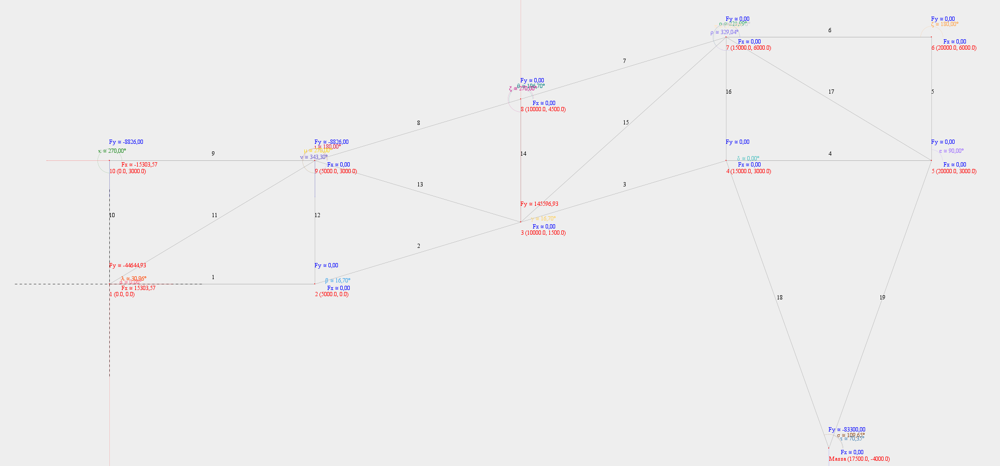

## Matriz de Rigidez de cada elemento:
|ELEMENTO|α|λ|μ|λ²|μ²|λ.μ|A[mm²]|L[mm]|E[kgf/mm²]|EA/L|
|---|---|---|---|---|---|---|---|---|---|---|
|1|0|1|0|1|0|0|231,854375|5000|200000|9274,175|
|2|16,699244234|0,9578262852|0,2873478856|0,9174311927|0,0825688073|0,2752293578|231,854375|5220,1532544553|200000|8883,0485887409|
|3|16,699244234|0,9578262852|0,2873478856|0,9174311927|0,0825688073|0,2752293578|231,854375|5220,1532544553|200000|8883,0485887409|
|4|0|1|0|1|0|0|231,854375|5000|200000|9274,175|
|5|90|0|1|0|1|0|231,854375|3000|200000|15456,9583333333|
|6|180|-1|0|1|0|-0|231,854375|5000|200000|9274,175|
|7|196,699244234|-0,9578262852|-0,2873478856|0,9174311927|0,0825688073|0,2752293578|231,854375|5220,1532544553|200000|8883,0485887409|
|8|196,699244234|-0,9578262852|-0,2873478856|0,9174311927|0,0825688073|0,2752293578|231,854375|5220,1532544553|200000|8883,0485887409|
|9|180|-1|0|1|0|-0|231,854375|5000|200000|9274,175|
|10|270|0|-1|0|1|-0|231,854375|3000|200000|15456,9583333333|
|11|30,9637565321|0,8574929257|0,5144957554|0,7352941176|0,2647058824|0,4411764706|231,854375|5830,9518948453|200000|7952,5394543201|
|12|270|0|-1|0|1|-0|231,854375|3000|200000|15456,9583333333|
|13|343,300755766|0,9578262852|-0,2873478856|0,9174311927|0,0825688073|-0,2752293578|231,854375|5220,1532544553|200000|8883,0485887409|
|14|270|0|-1|0|1|-0|231,854375|3000|200000|15456,9583333333|
|15|221,9872124958|-0,7432941462|-0,6689647316|0,5524861878|0,4475138122|0,4972375691|231,854375|6726,8120235369|200000|6893,4399887718|
|16|270|0|-1|0|1|-0|231,854375|3000|200000|15456,9583333333|
|17|329,0362434679|0,8574929257|-0,5144957554|0,7352941176|0,2647058824|-0,4411764706|231,854375|5830,9518948453|200000|7952,5394543201|

## Elementos
### Elemento 1
|1|2|3|4| |
|---|---|---|---|---|
|9274,175|0|-9274,175|-0|1|
|0|0|-0|-0|2|
|-9274,175|-0|9274,175|0|3|
|-0|-0|0|0|4|

### Elemento 2
|3|4|5|6| |
|---|---|---|---|---|
|8149,5858612302|2444,875758369|-8149,5858612302|-2444,875758369|3|
|2444,875758369|733,4627275107|-2444,875758369|-733,4627275107|4|
|-8149,5858612302|-2444,875758369|8149,5858612302|2444,875758369|5|
|-2444,875758369|-733,4627275107|2444,875758369|733,4627275107|6|

### Elemento 3
|5|6|7|8| |
|---|---|---|---|---|
|8149,5858612302|2444,875758369|-8149,5858612302|-2444,875758369|5|
|2444,875758369|733,4627275107|-2444,875758369|-733,4627275107|6|
|-8149,5858612302|-2444,875758369|8149,5858612302|2444,875758369|7|
|-2444,875758369|-733,4627275107|2444,875758369|733,4627275107|8|

### Elemento 4
|7|8|9|10| |
|---|---|---|---|---|
|9274,175|0|-9274,175|-0|7|
|0|0|-0|-0|8|
|-9274,175|-0|9274,175|0|9|
|-0|-0|0|0|10|

### Elemento 5
|9|10|11|12| |
|---|---|---|---|---|
|0|0|-0|-0|9|
|0|15456,9583333333|-0|-15456,9583333333|10|
|-0|-0|0|0|11|
|-0|-15456,9583333333|0|15456,9583333333|12|

### Elemento 6
|11|12|13|14| |
|---|---|---|---|---|
|9274,175|-0|-9274,175|0|11|
|-0|0|0|-0|12|
|-9274,175|0|9274,175|-0|13|
|0|-0|-0|0|14|

### Elemento 7
|13|14|15|16| |
|---|---|---|---|---|
|8149,5858612302|2444,875758369|-8149,5858612302|-2444,875758369|13|
|2444,875758369|733,4627275107|-2444,875758369|-733,4627275107|14|
|-8149,5858612302|-2444,875758369|8149,5858612302|2444,875758369|15|
|-2444,875758369|-733,4627275107|2444,875758369|733,4627275107|16|

### Elemento 8
|15|16|17|18| |
|---|---|---|---|---|
|8149,5858612302|2444,875758369|-8149,5858612302|-2444,875758369|15|
|2444,875758369|733,4627275107|-2444,875758369|-733,4627275107|16|
|-8149,5858612302|-2444,875758369|8149,5858612302|2444,875758369|17|
|-2444,875758369|-733,4627275107|2444,875758369|733,4627275107|18|

### Elemento 9
|17|18|19|20| |
|---|---|---|---|---|
|9274,175|-0|-9274,175|0|17|
|-0|0|0|-0|18|
|-9274,175|0|9274,175|-0|19|
|0|-0|-0|0|20|

### Elemento 10
|19|20|1|2| |
|---|---|---|---|---|
|0|-0|-0|0|19|
|-0|15456,9583333333|0|-15456,9583333333|20|
|-0|0|0|-0|1|
|0|-15456,9583333333|-0|15456,9583333333|2|

### Elemento 11
|1|2|17|18| |
|---|---|---|---|---|
|5847,4554811177|3508,4732886706|-5847,4554811177|-3508,4732886706|1|
|3508,4732886706|2105,0839732024|-3508,4732886706|-2105,0839732024|2|
|-5847,4554811177|-3508,4732886706|5847,4554811177|3508,4732886706|17|
|-3508,4732886706|-2105,0839732024|3508,4732886706|2105,0839732024|18|

### Elemento 12
|17|18|3|4| |
|---|---|---|---|---|
|0|-0|-0|0|17|
|-0|15456,9583333333|0|-15456,9583333333|18|
|-0|0|0|-0|3|
|0|-15456,9583333333|-0|15456,9583333333|4|

### Elemento 13
|17|18|5|6| |
|---|---|---|---|---|
|8149,5858612302|-2444,875758369|-8149,5858612302|2444,875758369|17|
|-2444,875758369|733,4627275107|2444,875758369|-733,4627275107|18|
|-8149,5858612302|2444,875758369|8149,5858612302|-2444,875758369|5|
|2444,875758369|-733,4627275107|-2444,875758369|733,4627275107|6|

### Elemento 14
|15|16|5|6| |
|---|---|---|---|---|
|0|-0|-0|0|15|
|-0|15456,9583333333|0|-15456,9583333333|16|
|-0|0|0|-0|5|
|0|-15456,9583333333|-0|15456,9583333333|6|

### Elemento 15
|13|14|5|6| |
|---|---|---|---|---|
|3808,5303805369|3427,6773424832|-3808,5303805369|-3427,6773424832|13|
|3427,6773424832|3084,9096082349|-3427,6773424832|-3084,9096082349|14|
|-3808,5303805369|-3427,6773424832|3808,5303805369|3427,6773424832|5|
|-3427,6773424832|-3084,9096082349|3427,6773424832|3084,9096082349|6|

### Elemento 16
|13|14|7|8| |
|---|---|---|---|---|
|0|-0|-0|0|13|
|-0|15456,9583333333|0|-15456,9583333333|14|
|-0|0|0|-0|7|
|0|-15456,9583333333|-0|15456,9583333333|8|

### Elemento 17
|13|14|9|10| |
|---|---|---|---|---|
|5847,4554811177|-3508,4732886706|-5847,4554811177|3508,4732886706|13|
|-3508,4732886706|2105,0839732024|3508,4732886706|-2105,0839732024|14|
|-5847,4554811177|3508,4732886706|5847,4554811177|-3508,4732886706|9|
|3508,4732886706|-2105,0839732024|-3508,4732886706|2105,0839732024|10|

## Matriz de Rigidez Global
|F|Valor (kN)|1|2|3|4|5|6|7|8|9|10|11|12|13|14|15|16|17|18|19|20||
|---|---|---|---|---|---|---|---|---|---|---|---|---|---|---|---|---|---|---|---|---|---|---|
|F1|F1|15121,6304811177|3508,4732886706|-9274,175|0|0|0|0|0|0|0|0|0|0|0|0|0|-5847,4554811177|-3508,4732886706|0|0|1|
|F2|F2|3508,4732886706|17562,0423065357|0|0|0|0|0|0|0|0|0|0|0|0|0|0|-3508,4732886706|-2105,0839732024|0|-15456,9583333333|2|
|F3|0.0|-9274,175|0|17423,7608612302|2444,875758369|-8149,5858612302|-2444,875758369|0|0|0|0|0|0|0|0|0|0|0|0|0|0|3|
|F4|0.0|0|0|2444,875758369|16190,421060844|-2444,875758369|-733,4627275107|0|0|0|0|0|0|0|0|0|0|0|-15456,9583333333|0|0|4|
|F5|0.0|0|0|-8149,5858612302|-2444,875758369|28257,2879642274|5872,5531008523|-8149,5858612302|-2444,875758369|0|0|0|0|-3808,5303805369|-3427,6773424832|0|0|-8149,5858612302|2444,875758369|0|0|5|
|F6|F6|0|0|-2444,875758369|-733,4627275107|5872,5531008523|20742,2561241004|-2444,875758369|-733,4627275107|0|0|0|0|-3427,6773424832|-3084,9096082349|0|-15456,9583333333|2444,875758369|-733,4627275107|0|0|6|
|F7|14868.0|0|0|0|0|-8149,5858612302|-2444,875758369|17423,7608612302|2444,875758369|-9274,175|0|0|0|0|0|0|0|0|0|0|0|7|
|F8|-41650.0|0|0|0|0|-2444,875758369|-733,4627275107|2444,875758369|16190,421060844|0|0|0|0|0|-15456,9583333333|0|0|0|0|0|0|8|
|F9|-14868.0|0|0|0|0|0|0|-9274,175|0|15121,6304811177|-3508,4732886706|0|0|-5847,4554811177|3508,4732886706|0|0|0|0|0|0|9|
|F10|-41650.0|0|0|0|0|0|0|0|0|-3508,4732886706|17562,0423065357|0|-15456,9583333333|3508,4732886706|-2105,0839732024|0|0|0|0|0|0|10|
|F11|0.0|0|0|0|0|0|0|0|0|0|0|9274,175|0|-9274,175|0|0|0|0|0|0|0|11|
|F12|0.0|0|0|0|0|0|0|0|0|0|-15456,9583333333|0|15456,9583333333|0|0|0|0|0|0|0|0|12|
|F13|0.0|0|0|0|0|-3808,5303805369|-3427,6773424832|0|0|-5847,4554811177|3508,4732886706|-9274,175|0|27079,7467228848|2364,0798121816|-8149,5858612302|-2444,875758369|0|0|0|0|13|
|F14|0.0|0|0|0|0|-3427,6773424832|-3084,9096082349|0|-15456,9583333333|3508,4732886706|-2105,0839732024|0|0|2364,0798121816|21380,4146422813|-2444,875758369|-733,4627275107|0|0|0|0|14|
|F15|0.0|0|0|0|0|0|0|0|0|0|0|0|0|-8149,5858612302|-2444,875758369|16299,1717224603|4889,7515167381|-8149,5858612302|-2444,875758369|0|0|15|
|F16|0.0|0|0|0|0|0|-15456,9583333333|0|0|0|0|0|0|-2444,875758369|-733,4627275107|4889,7515167381|16923,8837883548|-2444,875758369|-733,4627275107|0|0|16|
|F17|0.0|-5847,4554811177|-3508,4732886706|0|0|-8149,5858612302|2444,875758369|0|0|0|0|0|0|0|0|-8149,5858612302|-2444,875758369|31420,8022035781|3508,4732886706|-9274,175|0|17|
|F18|-8820.0|-3508,4732886706|-2105,0839732024|0|-15456,9583333333|2444,875758369|-733,4627275107|0|0|0|0|0|0|0|0|-2444,875758369|-733,4627275107|3508,4732886706|19028,9677615571|0|0|18|
|F19|F19|0|0|0|0|0|0|0|0|0|0|0|0|0|0|0|0|-9274,175|0|9274,175|0|19|
|F20|-8820.0|0|-15456,9583333333|0|0|0|0|0|0|0|0|0|0|0|0|0|0|0|0|0|15456,9583333333|20|
## Definir a matriz inversa para encontrar os deslocamentos.
|Deslocamento| | | | | | | | | | | | | | | | |Forças|
|---|---|---|---|---|---|---|---|---|---|---|---|---|---|---|---|---|---|
|U3|17423.760861230156|2444.875758369047|-8149.585861230157|0.0|0.0|0.0|0.0|0.0|0.0|0.0|0.0|0.0|0.0|0.0|0.0|0.0|0.0|
|U3|2444.875758369047|16190.421060844044|-2444.875758369047|0.0|0.0|0.0|0.0|0.0|0.0|0.0|0.0|0.0|0.0|0.0|-15456.95833333333|0.0|0.0|
|U3|-8149.585861230157|-2444.875758369047|28257.287964227387|-8149.585861230157|-2444.875758369047|0.0|0.0|0.0|0.0|-3808.530380536914|-3427.6773424832218|0.0|0.0|-8149.585861230157|2444.875758369047|0.0|0.0|
|U7|0.0|0.0|-8149.585861230157|17423.760861230156|2444.875758369047|-9274.175|0.0|0.0|0.0|0.0|0.0|0.0|0.0|0.0|0.0|0.0|14868.0|
|U8|0.0|0.0|-2444.875758369047|2444.875758369047|16190.421060844044|0.0|0.0|0.0|0.0|0.0|-15456.95833333333|0.0|0.0|0.0|0.0|0.0|-41650.0|
|U9|0.0|0.0|0.0|-9274.175|0.0|15121.630481117743|-3508.473288670647|0.0|0.0|-5847.455481117745|3508.473288670647|0.0|0.0|0.0|0.0|0.0|-14868.0|
|U8|0.0|0.0|0.0|0.0|0.0|-3508.473288670647|17562.042306535717|0.0|-15456.95833333333|3508.473288670647|-2105.0839732023887|0.0|0.0|0.0|0.0|0.0|-41650.0|
|U3|0.0|0.0|0.0|0.0|0.0|0.0|0.0|9274.175|0.0|-9274.175|0.0|0.0|0.0|0.0|0.0|0.0|0.0|
|U3|0.0|0.0|0.0|0.0|0.0|0.0|-15456.95833333333|0.0|15456.95833333333|0.0|0.0|0.0|0.0|0.0|0.0|0.0|0.0|
|U3|0.0|0.0|-3808.530380536914|0.0|0.0|-5847.455481117745|3508.473288670647|-9274.175|0.0|27079.746722884815|2364.0798121816197|-8149.585861230157|-2444.875758369045|0.0|0.0|0.0|0.0|
|U3|0.0|0.0|-3427.6773424832218|0.0|-15456.95833333333|3508.473288670647|-2105.0839732023887|0.0|0.0|2364.0798121816197|21380.414642281332|-2444.875758369045|-733.462727510713|0.0|0.0|0.0|0.0|
|U3|0.0|0.0|0.0|0.0|0.0|0.0|0.0|0.0|0.0|-8149.585861230157|-2444.875758369045|16299.171722460314|4889.75151673809|-8149.585861230157|-2444.875758369045|0.0|0.0|
|U3|0.0|0.0|0.0|0.0|0.0|0.0|0.0|0.0|0.0|-2444.875758369045|-733.462727510713|4889.75151673809|16923.883788354757|-2444.875758369045|-733.462727510713|0.0|0.0|
|U3|0.0|0.0|-8149.585861230157|0.0|0.0|0.0|0.0|0.0|0.0|0.0|0.0|-8149.585861230157|-2444.875758369045|31420.802203578056|3508.4732886706447|0.0|0.0|
|U18|0.0|-15456.95833333333|2444.875758369047|0.0|0.0|0.0|0.0|0.0|0.0|0.0|0.0|-2444.875758369045|-733.462727510713|3508.4732886706447|19028.96776155715|0.0|-8820.0|
|U18|0.0|0.0|0.0|0.0|0.0|0.0|0.0|0.0|0.0|0.0|0.0|0.0|0.0|0.0|0.0|15456.95833333333|-8820.0|
## Definir a matriz inversa para encontrar os deslocamentos.
|Deslocamento| | | | | | | | | | | | | | | | |Forças|Mult. Matrizes|
|---|---|---|---|---|---|---|---|---|---|---|---|---|---|---|---|---|---|---|
|U3|9.573273674321153E-5|-7.4456435105505E-5|5.9633407959141786E-5|3.1068330858039995E-5|9.52169236703397E-5|3.106833085804012E-5|1.9043384734067936E-4|-2.606182334416348E-5|1.9043384734067936E-4|-2.6061823344163484E-5|9.521692367033971E-5|2.5032537569387452E-6|9.801342434183186E-22|2.4187131731831146E-5|-7.227959324964021E-5|0.0|0.0|-11.259848600147118|
|U3|-7.445643510550499E-5|3.8084792137915236E-4|-4.4932991134547755E-5|1.1567832083859345E-5|-1.8833607739469118E-4|1.1567832083859103E-5|-3.7667215478938225E-4|1.2456947852067336E-4|-3.7667215478938225E-4|1.2456947852067338E-4|-1.8833607739469118E-4|6.806865530226537E-5|-3.829479560884781E-21|-3.0797634137535414E-5|3.29554298132667E-4|0.0|0.0|20.62592396093654|
|U3|5.9633407959141786E-5|-4.4932991134547755E-5|1.1401593586059118E-4|6.989423624291959E-5|1.4707233205890597E-4|6.989423624291976E-5|2.9414466411781183E-4|-1.8349162992423476E-5|2.9414466411781183E-4|-1.8349162992423476E-5|1.4707233205890597E-4|2.5772536625248798E-5|6.467143774080134E-22|4.24726379954073E-5|-5.566700456719328E-5|0.0|0.0|-17.885704910477653|
|U7|3.106833085803999E-5|1.156783208385934E-5|6.989423624291959E-5|3.1421143922398374E-4|-4.053719374807509E-4|3.142114392239834E-4|-3.3890560979120844E-4|2.8597688329204315E-4|-3.3890560979120833E-4|2.8597688329204325E-4|-3.859632030111081E-4|1.0883511152029048E-4|-8.614775400433487E-21|4.568964089304632E-5|5.975532529412133E-6|0.0|14868.0|30.9464556469677|
|U8|9.521692367033972E-5|-1.8833607739469118E-4|1.4707233205890594E-4|-4.0537193748075087E-4|0.001841480898465529|-4.05371937480749E-4|0.0027918654782347423|-0.0010144201542815596|0.0027918654782347423|-0.0010144201542815598|0.001776785116900053|-2.768752496501402E-4|3.2068745030973704E-20|-1.0723342992130133E-5|-2.0547512365535228E-4|0.0|-41650.0|-191.1665859989261|
|U9|3.106833085804012E-5|1.1567832083859081E-5|6.989423624291976E-5|3.1421143922398336E-4|-4.053719374807488E-4|4.220377418331101E-4|-1.591951054426593E-4|2.859768832920419E-4|-1.591951054426593E-4|2.8597688329204195E-4|-3.85963203011106E-4|1.088351115202901E-4|-6.819106743180696E-21|4.56896408930463E-5|5.975532529411852E-6|0.0|-14868.0|21.85835167365804|
|U8|1.9043384734067944E-4|-3.7667215478938236E-4|2.941446641178119E-4|-3.3890560979120844E-4|0.0027918654782347428|-1.5919510544265956E-4|0.006050650707147767|-0.0018100332491283316|0.006050650707147767|-0.001810033249128332|0.0028242133690174814|-5.537504993002803E-4|4.977214080392512E-20|-2.1446685984260225E-5|-4.1095024731070456E-4|0.0|-41650.0|-367.33815371855536|
|U3|-2.6061823344163498E-5|1.2456947852067338E-4|-1.834916299242345E-5|2.8597688329204325E-4|-0.0010144201542815598|2.85976883292042E-4|-0.001810033249128332|8.711710428092303E-4|-0.001810033249128332|7.633447402001037E-4|-0.00101442015428156|2.749602613103736E-4|-1.7800277938402096E-20|5.212364668832435E-5|1.292606067226228E-4|0.0|0.0|116.49840570072848|
|U3|1.9043384734067944E-4|-3.7667215478938236E-4|2.941446641178119E-4|-3.389056097912085E-4|0.0027918654782347428|-1.5919510544265965E-4|0.006050650707147767|-0.001810033249128332|0.006115346488713243|-0.0018100332491283323|0.0028242133690174814|-5.537504993002803E-4|3.5406791545902835E-20|-2.1446685984260225E-5|-4.1095024731070456E-4|0.0|0.0|-367.33815371855536|
|U3|-2.6061823344163498E-5|1.2456947852067338E-4|-1.834916299242345E-5|2.8597688329204325E-4|-0.0010144201542815598|2.85976883292042E-4|-0.001810033249128332|7.633447402001034E-4|-0.001810033249128332|7.633447402001037E-4|-0.00101442015428156|2.749602613103736E-4|-1.7800277938402096E-20|5.212364668832435E-5|1.292606067226228E-4|0.0|0.0|116.49840570072848|
|U3|9.521692367033975E-5|-1.8833607739469126E-4|1.4707233205890597E-4|-3.8596320301110805E-4|0.0017767851169000531|-3.8596320301110615E-4|0.0028242133690174805|-0.0010144201542815598|0.0028242133690174805|-0.00101442015428156|0.0017767851169000536|-2.7687524965014024E-4|2.488607040196256E-20|-1.0723342992130122E-5|-2.0547512365535236E-4|0.0|0.0|-189.81929634782512|
|U3|2.503253756938752E-6|6.806865530226532E-5|2.577253662524882E-5|1.0883511152029045E-4|-2.768752496501401E-4|1.0883511152029007E-4|-5.537504993002799E-4|2.749602613103734E-4|-5.537504993002799E-4|2.7496026131037344E-4|-2.7687524965014013E-4|1.9772030675622328E-4|-1.9408734469642844E-5|4.890664379068523E-5|6.761806962601633E-5|0.0|0.0|33.999171069683534|
|U3|-1.064048481167899E-21|1.8345931430294253E-21|-2.4093265727482002E-21|-4.4840686271563084E-21|1.4996315805664708E-20|-6.279737284409093E-21|2.9992631611329416E-20|-1.0249654527500114E-20|2.9992631611329416E-20|-1.3840991842005685E-20|1.499631580566471E-20|-1.9408734469642848E-5|6.469578156547619E-5|-3.498185959121765E-21|2.0683200830850875E-21|0.0|0.0|-1.8653342414545813E-15|
|U3|2.418713173183115E-5|-3.079763413753545E-5|4.24726379954073E-5|4.56896408930463E-5|-1.0723342992130048E-5|4.5689640893046284E-5|-2.1446685984260082E-5|5.212364668832426E-5|-2.1446685984260082E-5|5.2123646688324285E-5|-1.0723342992130061E-5|4.89066437906852E-5|-1.2320129587896104E-21|5.945203914546463E-5|-3.515131784926505E-5|0.0|0.0|1.649916330297167|
|U18|-7.227959324964021E-5|3.2955429813266707E-4|-5.566700456719328E-5|5.975532529412147E-6|-2.0547512365535234E-4|5.975532529411881E-6|-4.1095024731070456E-4|1.292606067226228E-4|-4.1095024731070456E-4|1.2926060672262282E-4|-2.0547512365535234E-4|6.76180696260164E-5|-4.0050058903714515E-21|-3.5151317849265025E-5|3.4256462491760227E-4|0.0|-8820.0|22.65269670896302|
|U18|0.0|0.0|0.0|0.0|0.0|0.0|0.0|0.0|0.0|0.0|0.0|0.0|0.0|0.0|0.0|6.469578156547619E-5|-8820.0|-0.5706167934074999|
## Encontrar as reações nos apoios.
| |Deslocamento|Resultado|
|---|---|---|
|F1|0|15301,6127825333|
|F2|0|-44654,5161652417|
|F3|-11.259848600147118|0|
|F4|20.62592396093654|0|
|F5|-17.885704910477653|-0,0000000003|
|F6|0|145594,5161652436|
|F7|30.9464556469677|14868,0000000006|
|F8|-191.1665859989261|-41649,9999999995|
|F9|21.85835167365804|-14868,0000000001|
|F10|-367.33815371855536|-41650,0000000013|
|F11|116.49840570072848|0|
|F12|-367.33815371855536|0|
|F13|116.49840570072848|-0,0000000002|
|F14|-189.81929634782512|-0,0000000005|
|F15|33.999171069683534|0|
|F16|-1.8653342414545813E-15|0|
|F17|1.649916330297167|0|
|F18|22.65269670896302|-8820|
|F19|0|-15301,6127825337|
|F20|-0.5706167934074999|-8820|
| |SOMA:|0,0000000002|

## Forças internas e Característica.
|Elemento|EA/L|λ|μ|Força|Característica|
|---|---|---|---|---|---|
|1|9274,175|1|0|-104425,8063912694|COMPRESSÃO|
|2|8883,0485887409|0,9578262852|0,2873478856|-109023,7426165002|COMPRESSÃO|
|3|8883,0485887409|0,9578262852|0,2873478856|-72473,1276826894|COMPRESSÃO|
|4|9274,175|1|0|-84284,6666666691|COMPRESSÃO|
|5|15456,9583333333|0|1|0|COMPRESSÃO|
|6|9274,175|-1|0|0|COMPRESSÃO|
|7|8883,0485887409|-0,9578262852|-0,2873478856|217419,3830480682|TRAÇÃO|
|8|8883,0485887409|-0,9578262852|-0,2873478856|217419,3830480683|TRAÇÃO|
|9|9274,175|-1|0|15301,6127825337|TRAÇÃO|
|10|15456,9583333333|0|-1|-8820|COMPRESSÃO|
|11|7952,5394543201|0,8574929257|0,5144957554|103935,7771198838|TRAÇÃO|
|12|15456,9583333333|0|-1|31327,7419173808|TRAÇÃO|
|13|8883,0485887409|0,9578262852|-0,2873478856|-108395,6404315676|COMPRESSÃO|
|14|15456,9583333333|0|-1|-0|COMPRESSÃO|
|15|6893,4399887718|-0,7432941462|-0,6689647316|-186781,1471868779|COMPRESSÃO|
|16|15456,9583333333|0|-1|20824,9999999993|TRAÇÃO|
|17|7952,5394543201|0,8574929257|-0,5144957554|80953,0488067715|TRAÇÃO|
