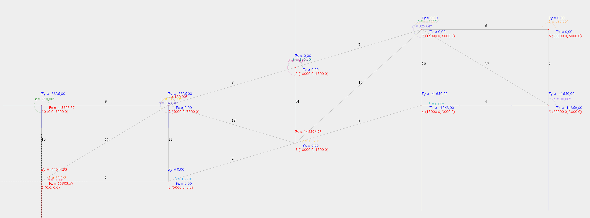
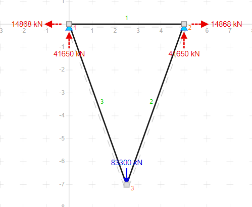

## Matriz de Rigidez de cada elemento:
|ELEMENTO|α|λ|μ|λ²|μ²|λ.μ|A[mm²]|L[mm]|E[kgf/mm²]|EA/L|
|---|---|---|---|---|---|---|---|---|---|---|
|1|0|1|0|1|0|0|231,854375|5000|21006,153926|974,0737379333|
|2|16,699244234|0,9578262852|0,2873478856|0,9174311927|0,0825688073|0,2752293578|231,854375|5220,1532544553|21006,153926|932,9934299361|
|3|16,699244234|0,9578262852|0,2873478856|0,9174311927|0,0825688073|0,2752293578|231,854375|5220,1532544553|21006,153926|932,9934299361|
|4|0|1|0|1|0|0|231,854375|5000|21006,153926|974,0737379333|
|5|90|0|1|0|1|0|231,854375|3000|21006,153926|1623,4562298888|
|6|180|-1|0|1|0|-0|231,854375|5000|21006,153926|974,0737379333|
|7|196,699244234|-0,9578262852|-0,2873478856|0,9174311927|0,0825688073|0,2752293578|231,854375|5220,1532544553|21006,153926|932,9934299361|
|8|196,699244234|-0,9578262852|-0,2873478856|0,9174311927|0,0825688073|0,2752293578|231,854375|5220,1532544553|21006,153926|932,9934299361|
|9|180|-1|0|1|0|-0|231,854375|5000|21006,153926|974,0737379333|
|10|270|0|-1|0|1|-0|231,854375|3000|21006,153926|1623,4562298888|
|11|30,9637565321|0,8574929257|0,5144957554|0,7352941176|0,2647058824|0,4411764706|231,854375|5830,9518948453|21006,153926|835,2613394002|
|12|270|0|-1|0|1|-0|231,854375|3000|21006,153926|1623,4562298888|
|13|343,300755766|0,9578262852|-0,2873478856|0,9174311927|0,0825688073|-0,2752293578|231,854375|5220,1532544553|21006,153926|932,9934299361|
|14|270|0|-1|0|1|-0|231,854375|3000|21006,153926|1623,4562298888|
|15|221,9872124958|-0,7432941462|-0,6689647316|0,5524861878|0,4475138122|0,4972375691|231,854375|6726,8120235369|21006,153926|724,0233074189|
|16|270|0|-1|0|1|-0|231,854375|3000|21006,153926|1623,4562298888|
|17|329,0362434679|0,8574929257|-0,5144957554|0,7352941176|0,2647058824|-0,4411764706|231,854375|5830,9518948453|21006,153926|835,2613394002|

## Elementos
### Elemento 1
|1|2|3|4| |
|---|---|---|---|---|
|974,0737379333|0|-974,0737379333|-0|1|
|0|0|-0|-0|2|
|-974,0737379333|-0|974,0737379333|0|3|
|-0|-0|0|0|4|

### Elemento 2
|3|4|5|6| |
|---|---|---|---|---|
|855,9572751708|256,7871825512|-855,9572751708|-256,7871825512|3|
|256,7871825512|77,0361547654|-256,7871825512|-77,0361547654|4|
|-855,9572751708|-256,7871825512|855,9572751708|256,7871825512|5|
|-256,7871825512|-77,0361547654|256,7871825512|77,0361547654|6|

### Elemento 3
|5|6|7|8| |
|---|---|---|---|---|
|855,9572751708|256,7871825512|-855,9572751708|-256,7871825512|5|
|256,7871825512|77,0361547654|-256,7871825512|-77,0361547654|6|
|-855,9572751708|-256,7871825512|855,9572751708|256,7871825512|7|
|-256,7871825512|-77,0361547654|256,7871825512|77,0361547654|8|

### Elemento 4
|7|8|9|10| |
|---|---|---|---|---|
|974,0737379333|0|-974,0737379333|-0|7|
|0|0|-0|-0|8|
|-974,0737379333|-0|974,0737379333|0|9|
|-0|-0|0|0|10|

### Elemento 5
|9|10|11|12| |
|---|---|---|---|---|
|0|0|-0|-0|9|
|0|1623,4562298888|-0|-1623,4562298888|10|
|-0|-0|0|0|11|
|-0|-1623,4562298888|0|1623,4562298888|12|

### Elemento 6
|11|12|13|14| |
|---|---|---|---|---|
|974,0737379333|-0|-974,0737379333|0|11|
|-0|0|0|-0|12|
|-974,0737379333|0|974,0737379333|-0|13|
|0|-0|-0|0|14|

### Elemento 7
|13|14|15|16| |
|---|---|---|---|---|
|855,9572751708|256,7871825512|-855,9572751708|-256,7871825512|13|
|256,7871825512|77,0361547654|-256,7871825512|-77,0361547654|14|
|-855,9572751708|-256,7871825512|855,9572751708|256,7871825512|15|
|-256,7871825512|-77,0361547654|256,7871825512|77,0361547654|16|

### Elemento 8
|15|16|17|18| |
|---|---|---|---|---|
|855,9572751708|256,7871825512|-855,9572751708|-256,7871825512|15|
|256,7871825512|77,0361547654|-256,7871825512|-77,0361547654|16|
|-855,9572751708|-256,7871825512|855,9572751708|256,7871825512|17|
|-256,7871825512|-77,0361547654|256,7871825512|77,0361547654|18|

### Elemento 9
|17|18|19|20| |
|---|---|---|---|---|
|974,0737379333|-0|-974,0737379333|0|17|
|-0|0|0|-0|18|
|-974,0737379333|0|974,0737379333|-0|19|
|0|-0|-0|0|20|

### Elemento 10
|19|20|1|2| |
|---|---|---|---|---|
|0|-0|-0|0|19|
|-0|1623,4562298888|0|-1623,4562298888|20|
|-0|0|0|-0|1|
|0|-1623,4562298888|-0|1623,4562298888|2|

### Elemento 11
|1|2|17|18| |
|---|---|---|---|---|
|614,162749559|368,4976497354|-614,162749559|-368,4976497354|1|
|368,4976497354|221,0985898412|-368,4976497354|-221,0985898412|2|
|-614,162749559|-368,4976497354|614,162749559|368,4976497354|17|
|-368,4976497354|-221,0985898412|368,4976497354|221,0985898412|18|

### Elemento 12
|17|18|3|4| |
|---|---|---|---|---|
|0|-0|-0|0|17|
|-0|1623,4562298888|0|-1623,4562298888|18|
|-0|0|0|-0|3|
|0|-1623,4562298888|-0|1623,4562298888|4|

### Elemento 13
|17|18|5|6| |
|---|---|---|---|---|
|855,9572751708|-256,7871825512|-855,9572751708|256,7871825512|17|
|-256,7871825512|77,0361547654|256,7871825512|-77,0361547654|18|
|-855,9572751708|256,7871825512|855,9572751708|-256,7871825512|5|
|256,7871825512|-77,0361547654|-256,7871825512|77,0361547654|6|

### Elemento 14
|15|16|5|6| |
|---|---|---|---|---|
|0|-0|-0|0|15|
|-0|1623,4562298888|0|-1623,4562298888|16|
|-0|0|0|-0|5|
|0|-1623,4562298888|-0|1623,4562298888|6|

### Elemento 15
|13|14|5|6| |
|---|---|---|---|---|
|400,012877027|360,0115893243|-400,012877027|-360,0115893243|13|
|360,0115893243|324,0104303919|-360,0115893243|-324,0104303919|14|
|-400,012877027|-360,0115893243|400,012877027|360,0115893243|5|
|-360,0115893243|-324,0104303919|360,0115893243|324,0104303919|6|

### Elemento 16
|13|14|7|8| |
|---|---|---|---|---|
|0|-0|-0|0|13|
|-0|1623,4562298888|0|-1623,4562298888|14|
|-0|0|0|-0|7|
|0|-1623,4562298888|-0|1623,4562298888|8|

### Elemento 17
|13|14|9|10| |
|---|---|---|---|---|
|614,162749559|-368,4976497354|-614,162749559|368,4976497354|13|
|-368,4976497354|221,0985898412|368,4976497354|-221,0985898412|14|
|-614,162749559|368,4976497354|614,162749559|-368,4976497354|9|
|368,4976497354|-221,0985898412|-368,4976497354|221,0985898412|10|

## Matriz de Rigidez Global
|F|Valor (kN)|1|2|3|4|5|6|7|8|9|10|11|12|13|14|15|16|17|18|19|20||
|---|---|---|---|---|---|---|---|---|---|---|---|---|---|---|---|---|---|---|---|---|---|---|
|F1|F1|1588,2364874923|368,4976497354|-974,0737379333|0|0|0|0|0|0|0|0|0|0|0|0|0|-614,162749559|-368,4976497354|0|0|1|
|F2|F2|368,4976497354|1844,5548197301|0|0|0|0|0|0|0|0|0|0|0|0|0|0|-368,4976497354|-221,0985898412|0|-1623,4562298888|2|
|F3|0.0|-974,0737379333|0|1830,0310131041|256,7871825512|-855,9572751708|-256,7871825512|0|0|0|0|0|0|0|0|0|0|0|0|0|0|3|
|F4|0.0|0|0|256,7871825512|1700,4923846542|-256,7871825512|-77,0361547654|0|0|0|0|0|0|0|0|0|0|0|-1623,4562298888|0|0|4|
|F5|0.0|0|0|-855,9572751708|-256,7871825512|2967,8847025393|616,7987718756|-855,9572751708|-256,7871825512|0|0|0|0|-400,012877027|-360,0115893243|0|0|-855,9572751708|256,7871825512|0|0|5|
|F6|F6|0|0|-256,7871825512|-77,0361547654|616,7987718756|2178,5751245768|-256,7871825512|-77,0361547654|0|0|0|0|-360,0115893243|-324,0104303919|0|-1623,4562298888|256,7871825512|-77,0361547654|0|0|6|
|F7|14868.0|0|0|0|0|-855,9572751708|-256,7871825512|1830,0310131041|256,7871825512|-974,0737379333|0|0|0|0|0|0|0|0|0|0|0|7|
|F8|-41650.0|0|0|0|0|-256,7871825512|-77,0361547654|256,7871825512|1700,4923846542|0|0|0|0|0|-1623,4562298888|0|0|0|0|0|0|8|
|F9|-14868.0|0|0|0|0|0|0|-974,0737379333|0|1588,2364874923|-368,4976497354|0|0|-614,162749559|368,4976497354|0|0|0|0|0|0|9|
|F10|-41650.0|0|0|0|0|0|0|0|0|-368,4976497354|1844,5548197301|0|-1623,4562298888|368,4976497354|-221,0985898412|0|0|0|0|0|0|10|
|F11|0.0|0|0|0|0|0|0|0|0|0|0|974,0737379333|0|-974,0737379333|0|0|0|0|0|0|0|11|
|F12|0.0|0|0|0|0|0|0|0|0|0|-1623,4562298888|0|1623,4562298888|0|0|0|0|0|0|0|0|12|
|F13|0.0|0|0|0|0|-400,012877027|-360,0115893243|0|0|-614,162749559|368,4976497354|-974,0737379333|0|2844,2066396901|248,3011221402|-855,9572751708|-256,7871825512|0|0|0|0|13|
|F14|0.0|0|0|0|0|-360,0115893243|-324,0104303919|0|-1623,4562298888|368,4976497354|-221,0985898412|0|0|248,3011221402|2245,6014048873|-256,7871825512|-77,0361547654|0|0|0|0|14|
|F15|0.0|0|0|0|0|0|0|0|0|0|0|0|0|-855,9572751708|-256,7871825512|1711,9145503415|513,5743651025|-855,9572751708|-256,7871825512|0|0|15|
|F16|0.0|0|0|0|0|0|-1623,4562298888|0|0|0|0|0|0|-256,7871825512|-77,0361547654|513,5743651025|1777,5285394196|-256,7871825512|-77,0361547654|0|0|16|
|F17|0.0|-614,162749559|-368,4976497354|0|0|-855,9572751708|256,7871825512|0|0|0|0|0|0|0|0|-855,9572751708|-256,7871825512|3300,1510378338|368,4976497354|-974,0737379333|0|17|
|F18|-8826.0|-368,4976497354|-221,0985898412|0|-1623,4562298888|256,7871825512|-77,0361547654|0|0|0|0|0|0|0|0|-256,7871825512|-77,0361547654|368,4976497354|1998,6271292608|0|0|18|
|F19|F19|0|0|0|0|0|0|0|0|0|0|0|0|0|0|0|0|-974,0737379333|0|974,0737379333|0|19|
|F20|-8826.0|0|-1623,4562298888|0|0|0|0|0|0|0|0|0|0|0|0|0|0|0|0|0|1623,4562298888|20|
## Definir a matriz inversa para encontrar os deslocamentos.
|Deslocamento| | | | | | | | | | | | | | | | |Forças|
|---|---|---|---|---|---|---|---|---|---|---|---|---|---|---|---|---|---|
|U3|1830.0310131040744|256.7871825512309|-855.9572751707695|0.0|0.0|0.0|0.0|0.0|0.0|0.0|0.0|0.0|0.0|0.0|0.0|0.0|0.0|
|U3|256.7871825512309|1700.4923846542108|-256.7871825512309|0.0|0.0|0.0|0.0|0.0|0.0|0.0|0.0|0.0|0.0|0.0|-1623.4562298888416|0.0|0.0|
|U3|-855.9572751707695|-256.7871825512309|2967.8847025393375|-855.9572751707695|-256.7871825512309|0.0|0.0|0.0|0.0|-400.0128770270288|-360.0115893243258|0.0|0.0|-855.9572751707695|256.7871825512309|0.0|0.0|
|U7|0.0|0.0|-855.9572751707695|1830.0310131040744|256.7871825512309|-974.0737379333049|0.0|0.0|0.0|0.0|0.0|0.0|0.0|0.0|0.0|0.0|14868.0|
|U8|0.0|0.0|-256.7871825512309|256.7871825512309|1700.4923846542108|0.0|0.0|0.0|0.0|0.0|-1623.4562298888416|0.0|0.0|0.0|0.0|0.0|-41650.0|
|U9|0.0|0.0|0.0|-974.0737379333049|0.0|1588.2364874922634|-368.49764973537515|0.0|0.0|-614.1627495589586|368.49764973537515|0.0|0.0|0.0|0.0|0.0|-14868.0|
|U8|0.0|0.0|0.0|0.0|0.0|-368.49764973537515|1844.5548197300666|0.0|-1623.4562298888416|368.49764973537515|-221.0985898412251|0.0|0.0|0.0|0.0|0.0|-41650.0|
|U3|0.0|0.0|0.0|0.0|0.0|0.0|0.0|974.0737379333049|0.0|-974.0737379333049|0.0|0.0|0.0|0.0|0.0|0.0|0.0|
|U3|0.0|0.0|0.0|0.0|0.0|0.0|-1623.4562298888416|0.0|1623.4562298888416|0.0|0.0|0.0|0.0|0.0|0.0|0.0|0.0|
|U3|0.0|0.0|-400.0128770270288|0.0|0.0|-614.1627495589586|368.49764973537515|-974.0737379333049|0.0|2844.206639690062|248.3011221401813|-855.9572751707695|-256.78718255123067|0.0|0.0|0.0|0.0|
|U3|0.0|0.0|-360.0115893243258|0.0|-1623.4562298888416|368.49764973537515|-221.0985898412251|0.0|0.0|248.3011221401813|2245.601404887329|-256.78718255123067|-77.03615476536915|0.0|0.0|0.0|0.0|
|U3|0.0|0.0|0.0|0.0|0.0|0.0|0.0|0.0|0.0|-855.9572751707695|-256.78718255123067|1711.914550341539|513.5743651024613|-855.9572751707695|-256.78718255123067|0.0|0.0|
|U3|0.0|0.0|0.0|0.0|0.0|0.0|0.0|0.0|0.0|-256.78718255123067|-77.03615476536915|513.5743651024613|1777.5285394195798|-256.78718255123067|-77.03615476536915|0.0|0.0|
|U3|0.0|0.0|-855.9572751707695|0.0|0.0|0.0|0.0|0.0|0.0|0.0|0.0|-855.9572751707695|-256.78718255123067|3300.1510378338025|368.4976497353749|0.0|0.0|
|U18|0.0|-1623.4562298888416|256.7871825512309|0.0|0.0|0.0|0.0|0.0|0.0|0.0|0.0|-256.78718255123067|-77.03615476536915|368.4976497353749|1998.627129260805|0.0|-8826.0|
|U18|0.0|0.0|0.0|0.0|0.0|0.0|0.0|0.0|0.0|0.0|0.0|0.0|0.0|0.0|0.0|1623.4562298888416|-8826.0|
## Definir a matriz inversa para encontrar os deslocamentos.
|Deslocamento| | | | | | | | | | | | | | | | |Forças|Mult. Matrizes|
|---|---|---|---|---|---|---|---|---|---|---|---|---|---|---|---|---|---|---|
|U3|9.1147324808203E-4|-7.089011664657735E-4|5.677708367673297E-4|2.958021822318077E-4|9.065621817850772E-4|2.958021822318087E-4|0.0018131243635701576|-2.481351268392379E-4|0.0018131243635701585|-2.481351268392379E-4|9.065621817850777E-4|2.3833527696287044E-5|-1.7096596202985843E-21|2.302861515443242E-4|-6.881754128267847E-4|0.0|0.0|-107.20110842043636|
|U3|-7.089011664657737E-4|0.0036260604651455453|-4.2780788232664165E-4|1.1013755421015823E-4|-0.0017931514551226743|1.1013755421015605E-4|-0.0035863029102453565|0.001186028427283762|-0.0035863029102453574|0.001186028427283762|-0.0017931514551226754|6.48082990746956E-4|-3.2056117880598454E-22|-2.932248734921085E-4|0.003137692880796871|0.0|0.0|196.36099695166533|
|U3|5.677708367673296E-4|-4.2780788232664143E-4|0.0010855479424005353|6.654643823818665E-4|0.0014002785333955682|6.654643823818679E-4|0.0028005570667911416|-1.747027376554736E-4|0.0028005570667911433|-1.747027376554736E-4|0.001400278533395569|2.4538082236319936E-4|-4.2741490507464E-21|4.043828122466302E-4|-5.300066329447609E-4|0.0|0.0|-170.286964205406|
|U7|2.9580218223180724E-4|1.1013755421015865E-4|6.654643823818655E-4|0.0029916132227810932|-0.0038595540993251903|0.00299161322278109|-0.0032267269009366435|0.002722791466724211|-0.0032267269009366452|0.002722791466724211|-0.0036747631610314375|0.0010362212131139418|1.7096596202984384E-20|4.3501195939057335E-4|5.689316140843335E-5|0.0|14868.0|294.64146461831456|
|U8|9.06562181785078E-4|-0.0017931514551226737|0.0014002785333955708|-0.0038595540993251855|0.017532775442402577|-0.00385955409932517|0.026581405506879787|-0.009658314014598981|0.0265814055068798|-0.009658314014598981|0.01691680564809007|-0.0026361346358358185|-6.838638481193754E-20|-1.020971571464775E-4|-0.001956332647843988|0.0|-41650.0|-1820.0890445877396|
|U9|2.958021822318082E-4|1.101375542101567E-4|6.65464382381867E-4|0.0029916132227810906|-0.003859554099325175|0.004018229546635279|-0.0015156996945129594|0.0027227914667242005|-0.00151569969451296|0.0027227914667242005|-0.0036747631610314214|0.0010362212131139388|0.0|4.350119593905732E-4|5.689316140843122E-5|0.0|-14868.0|208.11344996770345|
|U8|0.001813124363570159|-0.003586302910245354|0.0028005570667911464|-0.003226726900936634|0.026581405506879787|-0.0015156996945129486|0.057608363039353114|-0.01723336176155476|0.057608363039353135|-0.01723336176155476|0.02688939040403606|-0.005272269271671647|-1.3677276962387508E-19|-2.0419431429295564E-4|-0.003912665295687984|0.0|-41650.0|-3497.410228555965|
|U3|-2.4813512683923857E-4|0.0011860284272837615|-1.7470273765547543E-4|0.0027227914667242088|-0.009658314014598985|0.0027227914667241984|-0.017233361761554766|0.008294436438751843|-0.017233361761554773|0.007267820114897652|-0.009658314014598988|0.002617901994615432|3.419319240596877E-20|4.9627025367846E-4|0.0012306927501148249|0.0|0.0|1109.1762018642903|
|U3|0.001813124363570159|-0.003586302910245354|0.0028005570667911464|-0.003226726900936633|0.026581405506879787|-0.0015156996945129486|0.057608363039353114|-0.01723336176155476|0.05822433283366565|-0.01723336176155476|0.02688939040403606|-0.005272269271671647|-1.3677276962387508E-19|-2.0419431429295564E-4|-0.003912665295687984|0.0|0.0|-3497.410228555965|
|U3|-2.4813512683923857E-4|0.0011860284272837615|-1.7470273765547543E-4|0.0027227914667242088|-0.009658314014598985|0.0027227914667241984|-0.017233361761554766|0.007267820114897652|-0.017233361761554773|0.007267820114897652|-0.009658314014598988|0.002617901994615432|3.419319240596877E-20|4.9627025367846E-4|0.0012306927501148249|0.0|0.0|1109.1762018642903|
|U3|9.065621817850782E-4|-0.0017931514551226743|0.0014002785333955712|-0.0036747631610314323|0.016916805648090068|-0.003674763161031416|0.02688939040403606|-0.009658314014598985|0.02688939040403607|-0.009658314014598985|0.016916805648090075|-0.0026361346358358194|-6.838638481193754E-20|-1.0209715714647752E-4|-0.001956332647843989|0.0|0.0|-1807.2614736211824|
|U3|2.3833527696286773E-5|6.480829907469557E-4|2.453808223631987E-4|0.0010362212131139416|-0.0026361346358358215|0.0010362212131139383|-0.0052722692716716535|0.0026179019946154327|-0.005272269271671655|0.0026179019946154327|-0.002636134635835822|0.0018824988853528072|-1.8479093829375421E-4|4.656411065345167E-4|6.437929557616243E-4|0.0|0.0|323.7029061201343|
|U3|-2.17717991508857E-21|2.842734405070284E-20|5.6185673149499415E-21|-1.6598584346441054E-20|5.1261710600658733E-20|-1.6598584346441075E-20|-3.424934842255768E-20|-2.3420376022658168E-20|1.025234212013174E-19|-2.3420376022658168E-20|5.126171060065872E-20|-1.8479093829375421E-4|6.159697943125145E-4|-2.92957539363964E-21|2.854996504522179E-20|0.0|0.0|-9.60546876207036E-16|
|U3|2.302861515443241E-4|-2.9322487349210826E-4|4.0438281224663004E-4|4.350119593905736E-4|-1.0209715714647882E-4|4.350119593905734E-4|-2.0419431429295813E-4|4.962702536784609E-4|-2.041943142929584E-4|4.962702536784609E-4|-1.020971571464788E-4|4.656411065345169E-4|0.0|5.660440207655426E-4|-3.346763807700867E-4|0.0|0.0|15.710893522129336|
|U18|-6.881754128267847E-4|0.00313769288079687|-5.30006632944761E-4|5.689316140843281E-5|-0.001956332647843988|5.689316140843045E-5|-0.003912665295687985|0.0012306927501148247|-0.0039126652956879854|0.0012306927501148247|-0.0019563326478439893|6.437929557616242E-4|0.0|-3.346763807700868E-4|0.003261564455105692|0.0|-8826.0|215.65719646734385|
|U18|0.0|0.0|0.0|0.0|0.0|0.0|0.0|0.0|0.0|0.0|0.0|0.0|0.0|0.0|0.0|6.159697943125145E-4|-8826.0|-5.4365494046022524|
## Encontrar as reações nos apoios.
|Deslocamento|Valor (kN)| Resultado|
|---|---|---|
|F1|0|15303,5687793727|
|F2|0|-44644,9293661891|
|F3|-107.20110842043636|-0,0000000002|
|F4|196.36099695166533|0|
|F5|-170.286964205406|0,0000000003|
|F6|0|145596,9293661899|
|F7|294.64146461831456|14868|
|F8|-1820.0890445877396|-41649,9999999991|
|F9|208.11344996770345|-14867,9999999999|
|F10|-3497.410228555965|-41650,0000000005|
|F11|1109.1762018642903|0|
|F12|-3497.410228555965|0|
|F13|1109.1762018642903|-0,0000000002|
|F14|-1807.2614736211824|-0,0000000008|
|F15|323.7029061201343|0|
|F16|-9.60546876207036E-16|0|
|F17|15.710893522129336|-0,0000000002|
|F18|215.65719646734385|-8826|
|F19|0|-15303,5687793727|
|F20|-5.4365494046022524|-8826|
| |SOMA:|0,0000000002|

## Forças internas e Característica.
|Elemento|EA/L|λ|μ|Força|Característica|
|---|---|---|---|---|---|
|1|974,0737379333|1|0|-104421,7843896879|COMPRESSÃO|
|2|932,9934299361|0,9578262852|0,2873478856|-109019,5435235711|COMPRESSÃO|
|3|932,9934299361|0,9578262852|0,2873478856|-72473,1276826892|COMPRESSÃO|
|4|974,0737379333|1|0|-84284,6666666685|COMPRESSÃO|
|5|1623,4562298888|0|1|0|COMPRESSÃO|
|6|974,0737379333|-1|0|0|COMPRESSÃO|
|7|932,9934299361|-0,9578262852|-0,2873478856|217419,3830480654|TRAÇÃO|
|8|932,9934299361|-0,9578262852|-0,2873478856|217419,3830480656|TRAÇÃO|
|9|974,0737379333|-1|0|15303,5687793727|TRAÇÃO|
|10|1623,4562298888|0|-1|-8826|COMPRESSÃO|
|11|835,2613394002|0,8574929257|0,5144957554|103928,8056356399|TRAÇÃO|
|12|1623,4562298888|0|-1|31326,5353169063|TRAÇÃO|
|13|932,9934299361|0,9578262852|-0,2873478856|-108399,8395244941|COMPRESSÃO|
|14|1623,4562298888|0|-1|-0|COMPRESSÃO|
|15|724,0233074189|-0,7432941462|-0,6689647316|-186781,1471868752|COMPRESSÃO|
|16|1623,4562298888|0|-1|20824,9999999986|TRAÇÃO|
|17|835,2613394002|0,8574929257|-0,5144957554|80953,0488067712|TRAÇÃO|
