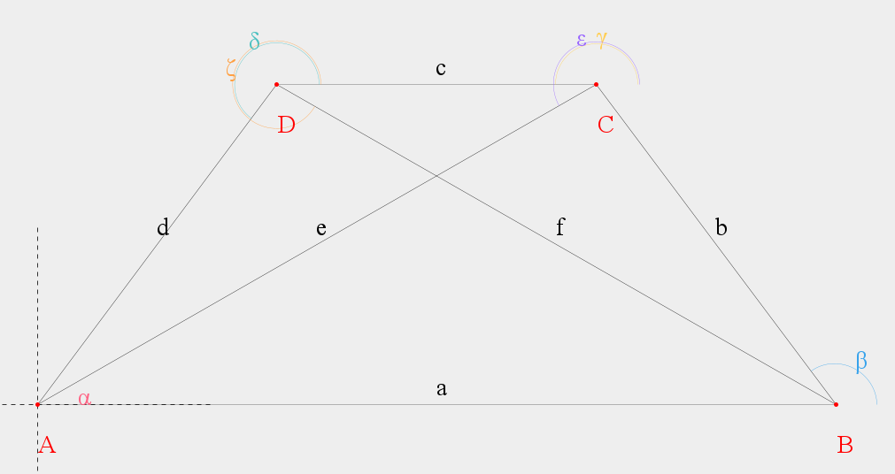
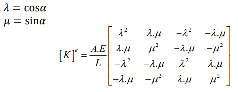
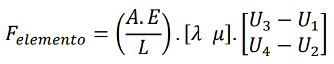

## Matriz de Rigidez de cada elemento:
|ELEMENTO|α|λ|μ|λ²|μ²|λ.μ|A[m²]|L[m]|E[kgf/mm²]|EA/L|
|---|---|---|---|---|---|---|---|---|---|---|
|a|0.0|1.0|0.0|1.0|0.0|0.0|0.0020268299163899908|5000.0|21006.153926|0.00851518024110197|
|b|126.86989764584402|-0.5999999999999999|0.8000000000000002|0.3599999999999998|0.6400000000000002|-0.48|0.0020268299163899908|2500.0|21006.153926|0.01703036048220394|
|c|180.0|-1.0|0.0|1.0|0.0|-0.0|0.0020268299163899908|2000.0|21006.153926|0.021287950602754926|
|d|233.13010235415598|-0.5999999999999999|-0.8000000000000002|0.3599999999999998|0.6400000000000002|0.48|0.0020268299163899908|2500.0|21006.153926|0.01703036048220394|
|e|209.7448812969422|-0.8682431421244593|-0.4961389383568336|0.753846153846154|0.24615384615384592|0.4307692307692306|0.0020268299163899908|4031.128874149275|21006.153926|0.010561781211843549|
|f|330.2551187030578|0.8682431421244592|-0.49613893835683376|0.7538461538461538|0.24615384615384608|-0.4307692307692307|0.0020268299163899908|4031.128874149275|21006.153926|0.010561781211843549|

## Elementos
### Elemento a
|1|2|3|4| |
|---|---|---|---|---|
|0,0085151802|0|-0,0085151802|-0|1|
|0|0|-0|-0|2|
|-0,0085151802|-0|0,0085151802|0|3|
|-0|-0|0|0|4|

### Elemento b
|3|4|5|6| |
|---|---|---|---|---|
|0,0061309298|-0,008174573|-0,0061309298|0,008174573|3|
|-0,008174573|0,0108994307|0,008174573|-0,0108994307|4|
|-0,0061309298|0,008174573|0,0061309298|-0,008174573|5|
|0,008174573|-0,0108994307|-0,008174573|0,0108994307|6|

### Elemento c
|5|6|7|8| |
|---|---|---|---|---|
|0,0212879506|-0|-0,0212879506|0|5|
|-0|0|0|-0|6|
|-0,0212879506|0|0,0212879506|-0|7|
|0|-0|-0|0|8|

### Elemento d
|7|8|1|2| |
|---|---|---|---|---|
|0,0061309298|0,008174573|-0,0061309298|-0,008174573|7|
|0,008174573|0,0108994307|-0,008174573|-0,0108994307|8|
|-0,0061309298|-0,008174573|0,0061309298|0,008174573|1|
|-0,008174573|-0,0108994307|0,008174573|0,0108994307|2|

### Elemento e
|5|6|1|2| |
|---|---|---|---|---|
|0,0079619581|0,0045496904|-0,0079619581|-0,0045496904|5|
|0,0045496904|0,0025998231|-0,0045496904|-0,0025998231|6|
|-0,0079619581|-0,0045496904|0,0079619581|0,0045496904|1|
|-0,0045496904|-0,0025998231|0,0045496904|0,0025998231|2|

### Elemento f
|7|8|3|4| |
|---|---|---|---|---|
|0,0079619581|-0,0045496904|-0,0079619581|0,0045496904|7|
|-0,0045496904|0,0025998231|0,0045496904|-0,0025998231|8|
|-0,0079619581|0,0045496904|0,0079619581|-0,0045496904|3|
|0,0045496904|-0,0025998231|-0,0045496904|0,0025998231|4|

## Matriz de Rigidez Global
|F|Valor (kN)|1|2|3|4|5|6|7|8||
|---|---|---|---|---|---|---|---|---|---|---|
|F1|F1|0,0226080682|0,0127242634|-0,0085151802|0|-0,0079619581|-0,0045496904|-0,0061309298|-0,008174573|1|
|F2|F2|0,0127242634|0,0134992538|0|0|-0,0045496904|-0,0025998231|-0,008174573|-0,0108994307|2|
|F3|0.0|-0,0085151802|0|0,0226080682|-0,0127242634|-0,0061309298|0,008174573|-0,0079619581|0,0045496904|3|
|F4|F4|0|0|-0,0127242634|0,0134992538|0,008174573|-0,0108994307|0,0045496904|-0,0025998231|4|
|F5|1500.0|-0,0079619581|-0,0045496904|-0,0061309298|0,008174573|0,0353808385|-0,0036248827|-0,0212879506|0|5|
|F6|1200.0|-0,0045496904|-0,0025998231|0,008174573|-0,0108994307|-0,0036248827|0,0134992538|0|0|6|
|F7|0.0|-0,0061309298|-0,008174573|-0,0079619581|0,0045496904|-0,0212879506|0|0,0353808385|0,0036248827|7|
|F8|-8000.0|-0,008174573|-0,0108994307|0,0045496904|-0,0025998231|0|0|0,0036248827|0,0134992538|8|
## Definir a matriz inversa para encontrar os deslocamentos.
|Deslocamento| | | | | |Forças|
|---|---|---|---|---|---|---|
|U3|0.02260806815900822|-0.006130929773593416|0.008174573031457891|-0.007961958144312829|0.004549690368178759|0.0|
|U5|-0.006130929773593416|0.03538083852066117|-0.0036248826632791333|-0.021287950602754926|0.0|1500.0|
|U6|0.008174573031457891|-0.0036248826632791333|0.013499253776141244|0.0|0.0|1200.0|
|U3|-0.007961958144312829|-0.021287950602754926|0.0|0.03538083852066117|0.0036248826632791324|0.0|
|U8|0.004549690368178759|0.0|0.0|0.0036248826632791324|0.013499253776141244|-8000.0|
## Definir a matriz inversa para encontrar os deslocamentos.
|Deslocamento| | | | | |Forças|Mult. Matrizes|
|---|---|---|---|---|---|---|---|
|U3|107.32482537922455|48.60616225726889|-51.939388642003244|58.71866312195563|-51.93938864200323|0.0|426097.08615152526|
|U5|48.60616225726889|69.10172099803344|-10.878304470574252|55.726756613937916|-31.345876535378792|1500.0|341365.62841539143|
|U6|-51.939388642003244|-10.87830447057425|102.60935688387497|-20.593512106624427|23.035140045632513|1200.0|-77467.34881027152|
|U3|58.71866312195564|55.726756613937916|-20.59351210662443|79.21422186272018|-41.06108417142897|0.0|387366.59376438934|
|U8|-51.93938864200323|-31.345876535378796|23.035140045632517|-41.061084171428966|102.60935688387492|-8000.0|-840251.5018193085|
## Encontrar as reações nos apoios.
|Deslocamento|Valor (kN)| Resultado|
|---|---|---|
|F1|0|-1500|-1500|-1500|-1500|-1500|-1500|-1500|-1500|
|F2|0|4640|4640|4640|4640|4640|4640|4640|4640|
|F3|426097.08615152526|0|0|0|0|0|0|0|0|
|F4|0|2160|2160|2160|2160|2160|2160|2160|2160|
|F5|341365.62841539143|1500|1500|1500|1500|1500|1500|1500|1500|
|F6|-77467.34881027152|1200|1200|1200|1200|1200|1200|1200|1200|
|F7|387366.59376438934|0|0|0|0|0|0|0|0|
|F8|-840251.5018193085|-8000|-8000|-8000|-8000|-8000|-8000|-8000|-8000|
| |SOMA:|0.0

## Forças internas e Característica.
|Elemento|EA/L|λ|μ|Força|Característica|
|---|---|---|---|---|---|
|a|0,0085151802|1|0|3628,2934887886|TRAÇÃO|
|b|0,0170303605|-0,6|0,8|-189,6331390143|COMPRESSÃO|
|c|0,0212879506|-1|0|-979,2662780285|COMPRESSÃO|
|d|0,0170303605|-0,6|-0,8|-7489,6331390143|COMPRESSÃO|
|e|0,0105617812|-0,8682431421|-0,4961389384|2724,4515733599|TRAÇÃO|
|f|0,0105617812|0,8682431421|-0,4961389384|-4047,8449352108|COMPRESSÃO|
